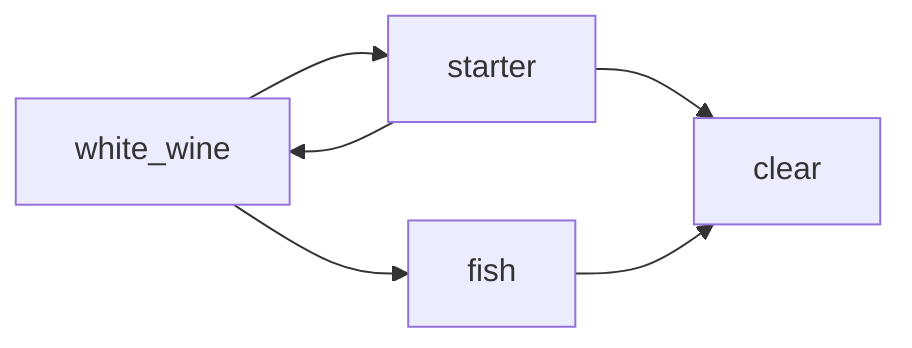
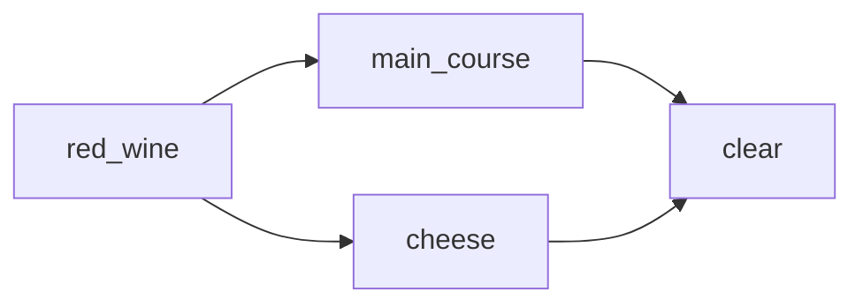

## 就餐礼仪
如果被邀请致辞，需要包含以下几点：
1. Thank the person who invited you.
1. Remaind why we are here.
1. Inform why you are here.
1. Wish

如果被邀请去参加晚宴，以在英国为例，需要清楚以下事项：
1. When
1. Why
1. Dress code
1. Location/Time -- 23:00 前结束

如果去别人家做客
1. 送花的话最好选择在当天早上送达并附上祝福卡片 -- 避免主人临时需要找花瓶等麻烦
1. 如果带一瓶酒做礼物，避免现场打开，因为主人通常也会准备酒 -- 可以推辞说"Since the travel, the wine is not in a good condition."

就餐顺序  
First step:

Then clear white wine glass and add water;

Second step:  

Then clear red wine glass

Final: Sweet

At the end only water glass.

小贴士:
Bon appetit ==> high class society dose not use.
The right one is "I wish you a nice meal."

- cut: Left hand with fork (down)
- eat: right hand with fork (up)

- You can leave the food you do not like. But if you ordered more, you should not leave it.
- Same tempo as the gasts
- For some dishes, do not ask more, e.g. cheese.
- Finish: The sharp side of the knife to your side.

## 领带条纹的positive direction
